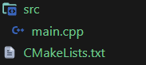
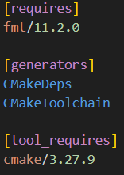

# Building for multiple configurations: Release, Debug | Static, Shared
:toc:
:sectnums:

== Introduction
If we take the previous example, where we have a simple `main.cpp` in the following project structure:



So far, we built a simple _CMake_ project that will depends on the *fmt* library and we saw that we can add some requirements for the tools like _CMake_ using `[tool_requires]` section, like so:



In all cases, we didn't specify that we want to build our application in neither _Release_, nor _Debug_ mode, or if we wanted to link against _Static_ or _Shared_ libraries. That's because Conan, if not instructed otherwise, will use a default configuration declared in the *default profile*. This default profile was created by using the following command: 
```sh
$ conan profile detect
```
Conan stores this file in the _/profile_ folder, located in the conan user home. You can even check the contents of your default profile by running the following:
```sh
$ conan config home
```
This command will get the location of the Conan user home and then will shows the contents of the default profile in the */profiles* folder:
```sh
$ conan config home
# Conan home: C:\Users\<username>\.conan2
```
So the return of the `conan config home` will give you the path to get to the home of conan2, you can then see the default profile through a simple cat command:
```sh
$ type C:\Users\<username>\.conan2\profiles\default 
# [settings]
# arch=x86_64
# build_type=Release
# compiler=msvc
# compiler.cppstd=14
# compiler.runtime=dynamic
# compiler.version=194
# os=Windows

# The default profile can also be checked with the command:
# conan profile show
```
As you may have noticed, the profile has different sections. The `[settings]` section is the one that has information related about things like the OS, architecture, compiler as well as build configuration.

When you call a _Conan_ command setting the `--profile` argument. Conan will take all the information from the profile you choose, and apply it to the packages you want to build or install. In case of you, not specify that argument, it's equivalent call it with `--profile=default`. These two commands will behave the same:
```sh
$ conan install . --build=missing
$ conan install . --build=missing --profile=default
```
You can store different profiles and use them to build for different settings. For example, to use a `build_type=Debug`, or adding a `[tool_requires]` to all the package you wuild with that profile. We'll create a debug profile to try building with several configurations:
```ini
[settings]
arch=x86_64
build_type=Debug
compiler=msvc
compiler.cppstd=14
compiler.runtime=dynamic
compiler.version=194
os=Windows
```
== Modifying settings
Use Debug configuration for the application and its dependencies in order to have the debug flags upon building the dependencies and the configuration thanks to profiles.

Using profiles is not the only way to set the configuration you want to use. You can also override the profile settings through the Conan command using the `--settings` argument. For instance, let say you wanna build a project from the previous example, using Debug configuration instead of the Release one.

Before building, check that we modified the source code from the previous article to show the build configuration:

```cpp
#include <iostream>
#include <fmt/base.h>

int main() {
    #ifdef NDEBUG
    fmt::println("Release configuration");
    #else
    fmt::println("Debug configuration");
    #endif
    return EXIT_SUCCESS;
}
```
Now, let's rebuild our project for Debug configuration:
```sh
$ conan install . --output-folder=build --build=missing --settings=build_type=Debug
```
As we explained above, this is the equivalent of using the _debug_ profile and running these command using `--profile=debug` argument instead of the `--settings=build_type=Debug` argument.

This `conan install` command will check if we already have the required libraries in the local cache (fmt) for Debug configuration and obtain them if not. It will also update the build configuration in the `conan_toolchain.cmake` and `CMakePresets.json` files that the `CMakeToolchain` generator creates so that when we build the application it's built in _Debug_ configuration. Now build your project as you did before in the previous articles and check in the output how it was built in Debug configuration:

```sh
$ cd build
$ cmake .. -DCMAKE_TOOLCHAIN_FILE=.\<path>\conan_toolchain.cmake
# -- Building for: Visual Studio 17 2022
# -- Using Conan toolchain: C:/<path>/conan_toolchain.cmake
# -- Conan toolchain: CMAKE_GENERATOR_TOOLSET=v143
# -- Conan toolchain: Setting CMAKE_MSVC_RUNTIME_LIBRARY=$<$<CONFIG:Debug>:MultiThreadedDebugDLL>
# -- Conan toolchain: C++ Standard 14 with extensions OFF
# -- The CXX compiler identification is MSVC 19.44.35209.0
# -- Detecting CXX compiler ABI info
# -- Detecting CXX compiler ABI info - done
# -- Check for working CXX compiler: C:/<path>/cl.exe - skipped
# -- Detecting CXX compile features
# -- Detecting CXX compile features - done
# -- Conan: Component target declared 'fmt::fmt'
Building with CMake version: 4.1.0-rc1
# -- Configuring done (7.6s)
# -- Generating done (0.0s)
# -- Build files have been written to: C:/<path>/Conan-Ep004/build
$ cmake --build . --config=Debug
# Version MSBuild 17.14.10+8b8e13593 pour .NET Framework

#   1>Checking Build System
#   Building Custom Rule C:/<path>/CMakeLists.txt
#   main.cpp
#   HelloWorld.vcxproj -> C:\<path>\HelloWorld.exe
#   Building Custom Rule C:/<path>/CMakeLists.txt
$ Debug\HelloWorld.exe
# Debug configuration
```
== Modifying options
Modifying the ption by linking the application dependencies as shared libraries.

So far, we have been linking _fmt_ statically, in our application. That's because in the fmt's Conan package, there's an attribute set to build in that mode by default. We can change from *static* to *shared* linking by settings the `shared` option to `True` using the `--options` argument. To do so, please, run the following:
```sh
$ conan install . --output-folder=build --build=missing --options=fmt/11.2.0:shared=True
```
Using the above command, will install the _fmt_ shared libraries, generate the files to build with them and, also the necessary files to locate those dynamic libraries when running the application.

NOTE: Options are defined per-package. In this case, we were defining that we wanted that specific version of _fmt/11.2.0_ as a shared library. If we had other dependencies and we want all of our dependencies (whenever possible) as shared libraries, we would use `-o *:shared=True`, with the `*` pattern that matches all packages references.

Now, let's build again our project using this shared library:
```sh
$ cd build
$ cmake .. -DCMAKE_TOOLCHAIN_FILE=<path>\conan_toolchain.cmake
$ cmake build . --config=Release
# Version MSBuild 17.14.10+8b8e13593 pour .NET Framework
#   1>Checking Build System
#   Building Custom Rule C:/<path>/CMakeLists.txt
#   main.cpp
#   HelloWorld.vcxproj -> C:\<path>\Release\HelloWorld.exe
#   Building Custom Rule C:/<path>/CMakeLists.txt
```
Now, if you try to run the compiled executable, you'll see an error because the executable cannot find the shared libraries of _fmt_ that we just installed.

This error happens because shared libraries (_.dll_ in Windows, _.dynlib_ on macOS, _.so_ on Linux), are loaded at runtime. That means that the application executable needs to know where the required shared libraries are when it runs. On Windows, the dynamic linker will search in the same directory, then in the _PATH_ directories. On macOS, it will search in the directories declared in _DYD_LIBRARY_PATH_, and on Linux, it will use the _LD_LIBARY_PATH_.

Nevertheless, Conan provides a mechanism to define those variables and make it possible, for executables, to find and load these shared libraries. This mechanism is the `VirtualBuildEnb` generator. If you check the output folder, you'll see that Conan generated a new file called `conanrun.bat/sh`. This is the result of automatically invoking that `VirtualRunEnv` generator when we activated the `shared` option when doing the `conan install`. This generated script will set the _PATH_, _LD_LIBRARY_PATH_, _DYLD_LIBRARY_PATH_ and _DYLD_FRAMEWORK_PATH_ environment variables so that executables can find the shared library.

In order to use that, you can activate the virtual environment by running the executable again:
```sh
$ conanrun.bat
$ Release\HelloWorld.exe
Release configuration
```
Just as the previous example, with the `VirtualBuildEnv` generator, when we run the `conanrun.bat` script, a deactivate script called `deactivate_conanrun.bat/sh` is created to restore the environment. Source or run it to do so:
```sh
$ deactivate_conanrun.bat/sh
```
== Difference between settings and options
You may have noticed that for changing between _Debug_ and _Release_ configuration, we used a Conan settings, but when we set a _shared_ mode for our executable, we used a Conan *option*. Please, note the difference between *settings* and *options*:

* Options are typically a project-wide configuration defined by the client machine. Things like the operating-system, compiler or build configuration that will be common to several Conan packages and would not make sense to define one default value for only one of them. For example, it doesn't make sense for a Conan package to declare "Visual Studio" as a default compiler because that is something defined by the end consumer, and unlikedly to make sense if they are working in Linux.
* Options are intended for package-specific configuration that can be set to a defualt value in the recipe. For example, one package can define that it's default linkage is static, and this is the linkage that shouls be used if consumers don't specify otherwise.

== Introducing the package id concept
When consumming packages like _fmt_ with different *settings* and even *options*, you might wonder how Conan determines which binary to retrieve from the remote. The answer lies in the concept of _package_id_.

=== Concept
The package_id is an identifier that Conan uses to determine the binary compatibility of packages. It is computed based on several factors, including the package's settings, options, and dependencies. When you modify any of these cactors, Conan computes a new package_id, to reference the corresponding binary.

Here is a breakdown of the process:

. *Determine Settings and Options*: Conan first retrieves the user's input settings and options. These can come from the command line or profiles like `--settings=build_type=Debug` or `--profile=debug`.
. *Compute the Package ID*: With the current values for settings, options and Dependencies, Conan computes an Hash. This hash serves as the _package_id_, representing the binary package's unique identity.
. *Fetch the binary*: Conan then checks its cache or the specified remote for a binary package with the computed _package_id_. If it finds a match, it retrieves that binary. If not, Conan can build the package from source or indicate that the binary is missing.

In the context of this article, when we consumed _fmt_ cith different _settings_ and _options_, Conan used the _packag_id_ to ensure that it fetched the correct binary and matched our specified configuration.